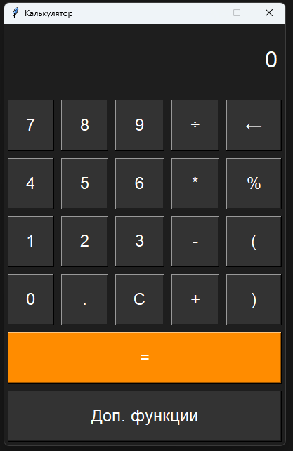
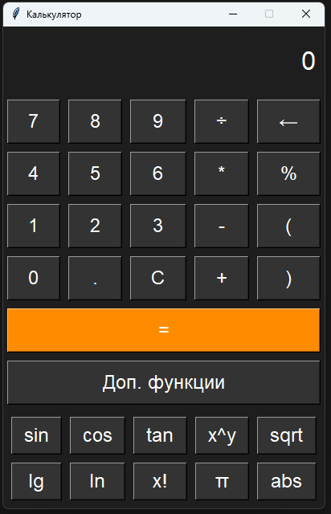

# Python Calculator 2024



## Description

**Python Calculator 2024** is a simple yet powerful calculator built using Python and the `tkinter` library for the graphical user interface. The calculator supports basic arithmetic operations as well as advanced functions for more complex calculations.

## Features

- **Basic Arithmetic Operations**: Addition, subtraction, multiplication, division.
- **Advanced Functions**: Support for trigonometric functions, logarithms and square roots.
- **User-Friendly Interface**: Built with `tkinter`, making it easy to use and navigate.



## Getting Started

To get started follow these steps:

1. **Clone the Repository**:
   ```bash
   git clone https://github.com/yourusername/python-calculator-2024.git
2. **Navigate to the Project Directory**:
   ```bash
   cd Python-Calculator-2024
3. **Run the calculator**:
   ```bash
   python Сalculator.py

## License

[](http://www.apache.org/licenses/LICENSE-2.0)

This project is licensed under the Apache License, Version 2.0. 
